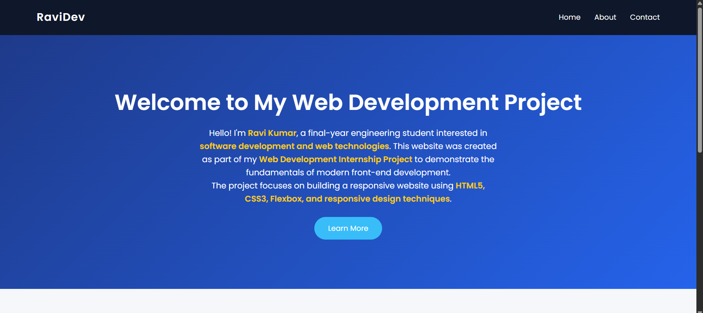
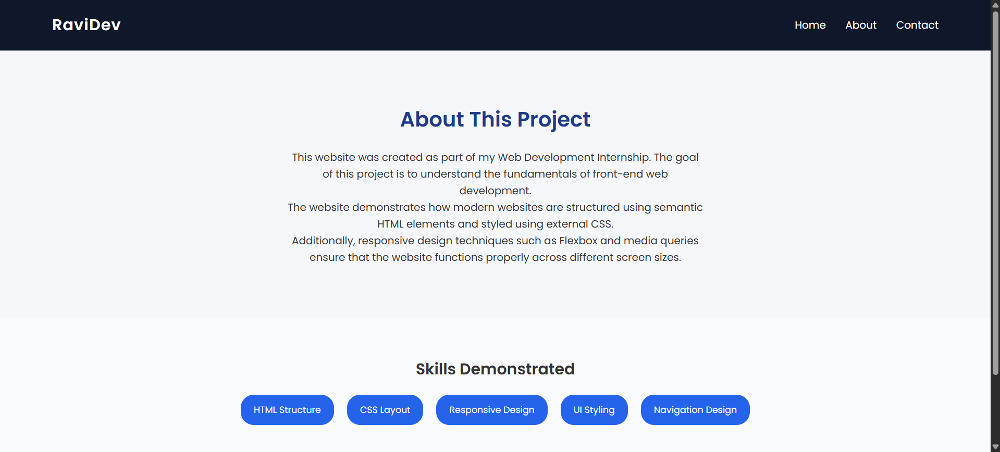
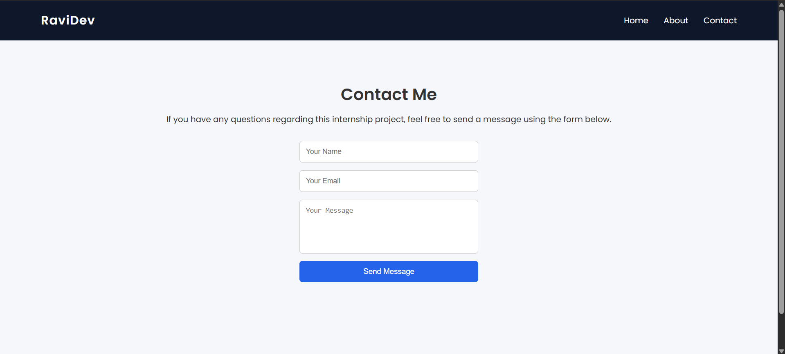

<h1 align="center">🌐 Web Development Internship Project</h1>

<p align="center">
A responsive multi-page website built using <b>HTML5</b> and <b>CSS3</b> as part of a Web Development Internship task.
</p>

<p align="center">


</p>

---

# 📖 Project Overview

This project was developed as part of my **Web Development Internship** to demonstrate the fundamentals of modern front-end web development.

The website focuses on:

- Clean **semantic HTML structure**
- Organized **external CSS styling**
- **Responsive design** using Flexbox and Media Queries
- User-friendly layout with multiple pages

The website is designed to work smoothly across **desktop, tablet, and mobile devices**.

---

# 🧩 Website Pages

| Page | Description |
|-----|-------------|
| 🏠 Home | Introduction to the project and overview of web technologies used |
| 👨‍💻 About | Information about the project and the developer |
| 📩 Contact | Contact form interface for user interaction |

---

# 📸 Website Preview

<p align="center">
<b>🏠 Home Page</b><br><br>

</p>

<p align="center">
<b>👨‍💻 About Page</b><br><br>

</p>

<p align="center">
<b>📩 Contact Page</b><br><br>

</p>

---

# 🚀 Technologies Used

- **HTML5** → Webpage structure and semantic elements  
- **CSS3** → Styling, layout, colors, and typography  
- **Flexbox** → Responsive layout alignment  
- **Media Queries** → Mobile responsiveness  

---

# 📂 Project Structure

```bash
web-development-internship-task-1
│
├── index.html
├── about.html
├── contact.html
├── style.css
└── README.md

```

---

# ✨ Features

✔ Responsive multi-page website  
✔ Semantic HTML structure  
✔ External CSS styling  
✔ Modern UI layout  
✔ Navigation menu linking all pages  
✔ Mobile-friendly design  

---

# 🎯 Objective of the Project

The main objective of this project is to understand and apply the **fundamental concepts of front-end web development**, including:

- Webpage structure using semantic HTML  
- Styling and layout with CSS  
- Responsive design principles  
- Clean and maintainable code structure  

---

# 👨‍💻 Author

**Ravi Kumar Chinta**  
Final Year Engineering Student  
Interested in **Web Development** and **Software Development**

---

# 📌 Internship Program

This project was developed as part of the **Web Development Internship Program at Redynox**.

During this internship task, the objective was to design and develop a **responsive multi-page website** using standard front-end technologies including **HTML5 and CSS3**. The project demonstrates semantic webpage structure, external CSS styling, and responsive design techniques to ensure compatibility across desktop and mobile devices.

---

# ⭐ Support

If you found this project useful, feel free to **star the repository** ⭐